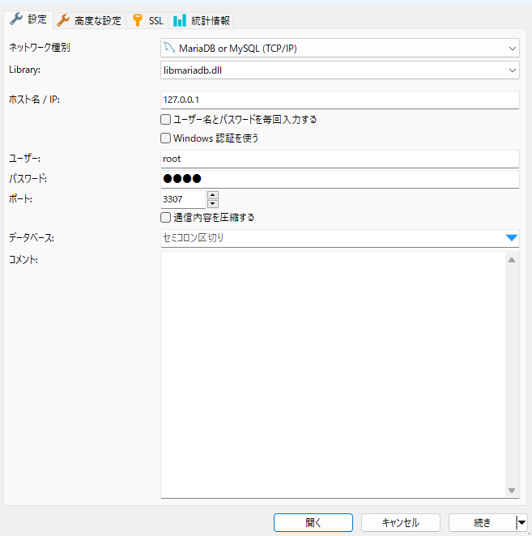

# 概要

このプロジェクトはdockerにてconcreteCMSの動作環境を構築することを目的としています。

## 経緯

## 前提

gitおよびdockerが動くwin機という想定

## 使い方

### 初回

```bash
git clone git@github.com:dev-higashi-organization/docker-simple-lamp.git
cd lamp
docker-compose build # そこそこ時間がかかります
docker-compose up -d # コンテナの立ち上げ
```

必要に応じてコンクリ本体をcloneしてください

```bash
git clone https://github.com/concretecms/concretecms.git
docker-compose exec web bash # Dockerの中に入る
cd concretecms
composer install
exit # Dockerから出る
```

### 初回以降

```bash
cd lamp
docker-compose up -d # コンテナの立ち上げ
```

## できるもの

### web

[http://localhost:81](http://localhost:81)

ドキュメントルートは、[/apache-php/apache.conf](/apache-php/apache.conf)ファイル  
121:`DocumentRoot "/var/www/html/concretecms"`  
135:`<Directory "/var/www/html/concretecms">`  
で設定しています。

設定変更した場合は

```bash
docker-compose build apache2
```

を、実行してください。

### DB:phpmyadmin

[http://localhost:8081](http://localhost:8081)

### DB:mysql

```bash
docker-compose exec db bash # Dockerの中に入る
bash-4.4# mysql -u root -p
Enter password:
```

### DB:クライアント

DBクライアントから接続する場合ポートを'3307'で指定してください。

